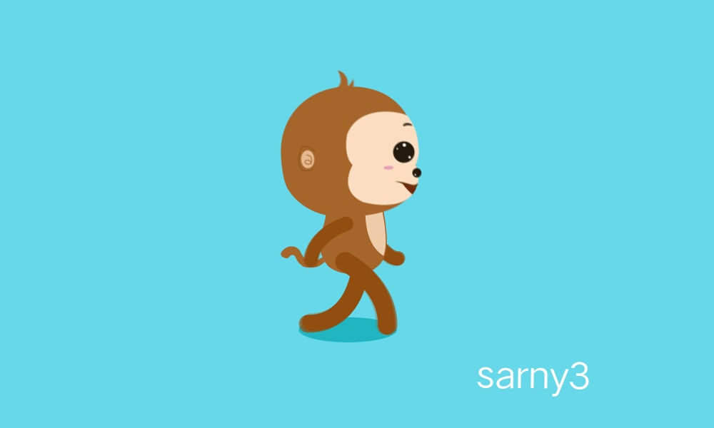

<!DOCTYPE html>
<html lang="en-US">
  <head>
    <meta charset="UTF-8">
    <meta http-equiv="X-UA-Compatible" content="IE=edge">
    <meta name="viewport" content="width=device-width, initial-scale=1">

<!-- Begin Jekyll SEO tag v2.8.0 -->
<title>周忠红</title>
<meta name="generator" content="Jekyll v3.10.0" />
<meta property="og:title" content="周忠红" />
<meta property="og:locale" content="en_US" />
<link rel="canonical" href="https://zhouzh0201.github.io/team.md/" />
<meta property="og:url" content="https://zhouzh0201.github.io/team.md/" />
<meta property="og:site_name" content="周忠红" />
<meta property="og:type" content="website" />
<meta name="twitter:card" content="summary" />
<meta property="twitter:title" content="周忠红" />

<!-- End Jekyll SEO tag -->

    <link rel="stylesheet" href="/assets/css/style.css?v=cda6a71e7dbafd374e1a20c9e466609484071de6">
    <!-- start custom head snippets, customize with your own _includes/head-custom.html file -->

<!-- Setup Google Analytics -->

<!-- You can set your favicon here -->
<!-- link rel="shortcut icon" type="image/x-icon" href="/favicon.ico" -->

<!-- end custom head snippets -->

  </head>
  <body>
    

      
      <h1><a href="https://zhouzh0201.github.io/">            周忠红</a></h1>
      

    

<html>
<head>
    <meta charset="utf-8" />
    <meta name="author" content="persinal homepage"/>
    <meta name="viewport" content="width=device-width, initial-scale=1.0"/>
     

    <title>Team</title>

    <link href="../static/bootstrap/css/bootstrap.css" rel="stylesheet"/>
    <link href="../static/xin.css" rel="stylesheet"/>

    
</head>

<body>
    <nav class="navbar navbar-inverse navbar-fixed-top">
        

            

                <button type="button" class="navbar-toggle" data-toggle="collapse" data-target=".navbar-collapse">
                    
                    
                    

                </button>
                
                     Homepage
                
            

            

                <ul class="nav navbar-nav">
                    <li><a href="../index.html">Home</a></li>
                    <li><a href="../publications/index.htm">Publications</a></li>
                    <li><a href="../projects/index.htm">Projects</a></li>
                    <li class="active"><a href="index.htm">Team</a></li>
                    <li><a href="../teaching/index.htm">Teaching</a></li>
                    <li><a href="../service/index.htm">Service</a></li>
                </ul>
            

        

    </nav>

    

        

            <h2>Post-doctoral Fellow</h2>
            

                

                    

                        
                    

                    

                        <a href="https://scholar.google.com.hk/citations?user=fXGIQ0EAAAAJ&hl=zh-CN&oi=ao" target="_blank"> Cuiqun Chen </a> 
                        Post-doctoral Fellow (2022)
                    

                

                

                    

                        
                    

                    

                        <a href="https://scholar.google.com.hk/citations?user=sW4XMmUAAAAJ&hl=zh-CN&oi=ao" target="_blank"> Fangyi Liu </a> 
                        Post-doctoral Fellow (2024) 
                    

                

                

                    

                        
                    

                    

                        <a href="https://scholar.google.com/citations?user=A_k-XFkAAAAJ" target="_blank"> Bin Yang </a> 
                        Post-doctoral Fellow (2024) 
                    

                

            

             
             

            <h2>Ph.D. Students</h2>

  

                <small>Copyright &copy 2025 <a href="https://zhouzh0201.github.io/">zhong personal homepage</a></small>
                 
                <small><a href="https://www.whu.edu.cn/">Wuhan University 武汉大学</a></small>
            

        

    

    

<!-- 

    <small>
        Copyright 2025 hong personal homepage
    </small>
  
 -->

  </body>
</html>
            
